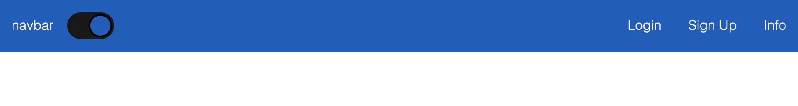
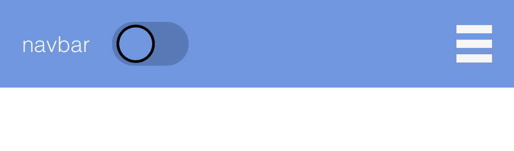

# navbar react component

### please refer to the package.json or prior to use install styled-components.

#

### this is a basic navbar with mobile responsiveness and a darktheme toggle button utilizing useState and styled-components.

#

## install necessary packages 

        npm i styled-components

#

## by William Wong
### https://github.com/billycwong19
